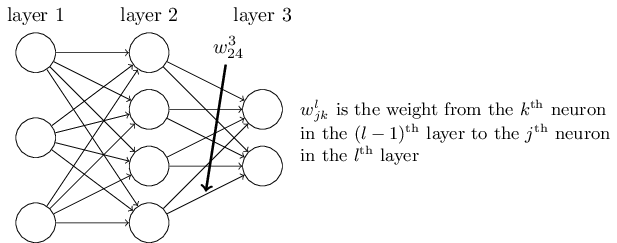

在MarkdownPad2中按下F6可以進行網頁預覽後

[LaTex速查](https://webdemo.myscript.com/views/math.html)

[方程式繪製](https://www.desmos.com/)

[Neural Network and Deep Learning](http://neuralnetworksanddeeplearning.com/)

$$ \tag{6} C(w,b)=\dfrac {1} {2n}\sum ^{n} _{x=1} \| y (x) -a(x) ^{L}\| ^{2}  $$

Mean squared error
$$ MSE = \dfrac {1} {n} \sum ^{n} _{i=1} ( Y _{i} - \widehat{Y} _{i} )^{2} $$

where: n is the total number of training examples; the sum is over individual training examples, x; y=y(x) is the corresponding desired output; L denotes the number of layers in the network; and \\( a ^{L} =a ^{L} (x) \\) is the vector of activations output from the network when x is input.

$$ C=\dfrac {1} {n} \sum ^{n} _{x=1}  C _{x} $$

$$ C_{x}=\dfrac {1} {2} \| y- a ^{L} \| ^{2} $$

The reason we need this assumption is because what backpropagation actually lets us do is compute the partial derivatives \\( \dfrac {\partial C _{x}} {\partial w} \\) and  \\( \dfrac {\partial C _{x}} {\partial b} \\) for a single training example. In fact, with this assumption in mind, we'll suppose the training example x has been fixed, and drop the x subscript, writing the cost \\( C _{x} \\) as C. We'll eventually put the x back in, but for now it's a notational nuisance that is better left implicit.

The second assumption we make about the cost is that it can be written as a function of the outputs from the neural network: 

\begin{align}
\begin{bmatrix}
w^{1} _{1}
\newline
w^{1} _{2}
\newline
w^{1} _{3}
\end{bmatrix}
\begin{bmatrix}
w^{2} _{1}
\newline
w^{2} _{2}
\newline
w^{2} _{3}
\newline
w^{2} _{4}
\end{bmatrix}
\begin{bmatrix}
w^{3} _{1}
\newline
w^{3} _{2}
\end{bmatrix}
\end{align}
上述結構 w b a 各有一份，除了輸入層外，為了方便可以把輸入層當成a的第0層 \\( a ^{0} _{j} \\) 表示。

假設A、B、C皆為一個矩陣，則矩陣乘法
\begin{align}
(ABC) ^{T} &= C ^{T} B ^{T} A ^{T}
\newline
ABC &= ((ABC) ^{T}) ^{T} = (C ^{T} B ^{T} A ^{T}) ^{T}
\end{align}

\begin{align}
C(\sum _{x=1} ^{n} TrainingExample _{x} ) &= \dfrac {1} {n} \sum _{x=1} ^{n} C _{x} (TrainingExample _{x})
\newline
C _{x} (TrainingExample _{x}) &= \dfrac { (output-a ^{L}) ^{2} } {2} = \dfrac { (y(x) -a ^{L}) ^{2} } {2}
\newline
a ^{L} &= σ(z ^{L}) =
\begin{bmatrix}
\dfrac {1} {1+e ^{-z ^{L} _{1}} }
\newline
.
\newline
.
\newline
.
\newline
\dfrac {1} {1+e ^{-z ^{L} _{j}} }
\end{bmatrix}
\newline
\newline
z ^{L} &= 
\begin{bmatrix}
\sum _{k} w ^{L} _{1k} a ^{L-1} _{k}  + b ^{L} _{1}
\newline
.
\newline
.
\newline
.
\newline
\sum _{k} w ^{L} _{jk} a ^{L-1} _{k}  + b ^{L} _{j}
\end{bmatrix}
=\begin{bmatrix}
(w ^{L} _{1}) ^{T} a ^{L-1}  + b ^{L} _{1}
\newline
.
\newline
.
\newline
.
\newline
(w ^{L} _{j}) ^{T} a ^{L-1}  + b ^{L} _{j}
\end{bmatrix}
\newline
\newline
a ^{L-1} &= 
\begin{bmatrix}
\dfrac {1} {1+e ^{-z ^{L-1} _{1}} }
\newline
.
\newline
.
\newline
.
\newline
\dfrac {1} {1+e ^{-z ^{L-1} _{j}} }
\end{bmatrix}
\newline
\newline
z ^{L-1} &= 
\begin{bmatrix}
\sum _{k} w ^{L-1} _{1k} a ^{L-2} _{k}  + b ^{L-1} _{1}
\newline
.
\newline
.
\newline
.
\newline
\sum _{k} w ^{L-1} _{jk} a ^{L-2} _{k}  + b ^{L-1} _{j}
\end{bmatrix}
=\begin{bmatrix}
(w ^{L-1} _{1}) ^{T} a ^{L-2}  + b ^{L-1} _{1}
\newline
.
\newline
.
\newline
.
\newline
(w ^{L-1} _{j}) ^{T} a ^{L-2}  + b ^{L-1} _{j}
\end{bmatrix}
\newline
\newline
.
\newline
.
\newline
.
\newline
a ^{1} &= 
\begin{bmatrix}
\dfrac {1} {1+e ^{-z ^{1} _{1}} }
\newline
.
\newline
.
\newline
.
\newline
\dfrac {1} {1+e ^{-z ^{1} _{j}} }
\end{bmatrix}
\newline
\newline
z ^{1} &= 
\begin{bmatrix}
\sum _{k} w ^{1} _{1k} a ^{0} _{k}  + b ^{1} _{1}
\newline
.
\newline
.
\newline
.
\newline
\sum _{k} w ^{1} _{jk} a ^{0} _{k}  + b ^{1} _{j}
\end{bmatrix}
=\begin{bmatrix}
(w ^{1} _{1}) ^{T} a ^{0}  + b ^{1} _{1}
\newline
.
\newline
.
\newline
.
\newline
(w ^{L} _{j}) ^{T} a ^{0}  + b ^{1} _{j}
\end{bmatrix}
\newline
\newline
a ^{0} &= input =
\begin{bmatrix}
a ^{0} _{1}
\newline
.
\newline
.
\newline
.
\newline
a ^{0} _{j}
\end{bmatrix}
\end{align}
每筆\\( TrainingExample _{x} \\)包含input跟ouput，當輸入資料為input時，對應的輸出則為output。
a代表 activation value，σ代表activation function，以上使用sigmoid為activation function。
若能讓C接近0，代表神經網路已經訓練好了，因此目標就是要想辦法讓C接近0，因此調整神經網路中的w跟b值。

\begin{align}
\Delta 表示對應原值得變動量, \nabla 為梯度，對應所有變數的微分。 \newline
C→C' &=C + \Delta C
\newline
\Delta C &\approx \nabla C _{1 \times m} \Delta v _{m \times 1}
\newline
&因為C的值是非線性，所以是趨近值。 \newline
&這裡的矩陣大小為1 \times m，其中m是w跟b所有變數的總和。 \newline
&\Delta v _{m \times 1} 包含所有w跟b變數的變動量，即為跟原本數值的差異量。 \newline
&\nabla C _{1 \times m} 對應所有w跟b變數的變動幅度，也就C對應所有w跟b梯度。 \newline
\newline
\nabla C _{1 \times m} &= \dfrac {1} {n} \sum _{x=1} ^{n} (\nabla C _{x}) _{ 1 \times m}  
\newline
&\nabla C _{1 \times m} =
\begin{bmatrix} \dfrac {\partial C} {\partial v _{1}} & \dfrac {\partial C} {\partial v _{2}} & . & . & . & \dfrac {\partial C} {\partial v _{m}} \end{bmatrix}
\newline
( &\nabla C _{x}) _{1 \times m} =
\begin{bmatrix} \dfrac {\partial C _{x} } {\partial v _{1}} & \dfrac {\partial C _{x} } {\partial v _{2}} & . & . & . & \dfrac {\partial C _{x} } {\partial v _{m}} \end{bmatrix}
\newline
\nabla C _{1 \times m} &= \dfrac {1} {n} \sum _{x=1} ^{n} (\nabla C _{x}) _{ 1 \times m} = 
\begin{bmatrix} \dfrac {1} {n} \sum _{x=1} ^{n} \dfrac { \partial C _{x} } {\partial v _{1}} & \dfrac {1} {n} \sum _{x=1} ^{n} \dfrac {\partial C _{x} } {\partial v _{2}} & . & . & . & \dfrac {1} {n} \sum _{x=1} ^{n} \dfrac {\partial C _{x} } {\partial v _{m}} \end{bmatrix} 
\newline
&\nabla C _{1 \times m} 是由n筆訓練資料的梯度 (\nabla C _{x}) _{ 1 \times m} 的總和平均值。\newline
&儘管在同一網路中，每筆訓練資料對應w跟b的梯度皆不同，因為輸入輸出不同造成各自對應的梯度。\newline
\newline
&為了使C變小，所以將 \Delta v _{m \times 1} 定義如下 \newline
\tag{14} \Delta v _{m \times 1} &= - \eta ( \nabla C _{1 \times m} )^{T} \newline
&\eta為正數，也就是所謂的learning \space rate \newline
\Delta C &\approx \nabla C _{1 \times m} \Delta v _{m \times 1} \newline
&\approx - \eta \nabla C _{1 \times m} ( \nabla C _{1 \times m} )^{T} \newline
&\approx - \eta \| \nabla C _{1 \times m} \| ^{2} \newline
C' &= C + \Delta C \newline
&= C - \eta \| \nabla C _{1 \times m} \| ^{2} \newline
& 如此一來C'必然會越來越小，接下來就是調整w跟b所有變數v _{m \times 1}。 \newline
v _{m \times 1} →v' _{m \times 1} &=v _{m \times 1} + \Delta v _{m \times 1} \newline
\tag{15} &=v _{m \times 1} - \eta ( \nabla C _{1 \times m} )^{T} \newline
v' _{m \times 1} &=
\begin{bmatrix}
v _{1} - \eta \dfrac {\partial C} {\partial v _{1}}
\newline
.
\newline
.
\newline
.
\newline
v _{m} - \eta \dfrac {\partial C} {\partial v _{m}}
\end{bmatrix} \newline
&將v'還原成w跟b的形式如下 \newline
\tag{16} w ^{l} _{jk} → w' ^{l} _{jk} &= w ^{l} _{jk} - \eta \dfrac {1} {n} \sum _{x=1} ^{n} \dfrac { \partial C _{x} } {\partial w ^{l} _{jk}} = w ^{l} _{jk} - \eta \dfrac {\partial C} {\partial w ^{l} _{jk}} \newline
\tag{17} b ^{l} _{j} → b' ^{l} _{j} &= b ^{l} _{j} - \eta \dfrac {1} {n} \sum _{x=1} ^{n} \dfrac { \partial C _{x} } {\partial b ^{l} _{j}} = b ^{l} _{j} - \eta \dfrac {\partial C} {\partial b ^{l} _{j}} \newline
\end{align}

接下來只要計算出 \\( \nabla C _{1 \times m } \\) 的梯度就能對w跟b進行調整，但是訓練資料的數量n為數龐大時，會計算很久，因此後來改用估算的方式取少數筆數訓練資料進行估算，也就是mini-batch。
Stochastic gradient descent隨機挑選mini-batch做w跟b的調整，每做完一次mini-batch的訓練稱為epoch。

$$ \tag{23} a ^{l} _{j} = \sigma( \sum _{k} w ^{l} _{jk} a ^{l-1} _{k} + b ^{l} _{j} ) $$

矩陣可以看成線性空間的向量與維度的關係，但無固定行列，會根據矩陣相乘的前後順序有所不同，如上公式所示。 比方說3維空間投射到2維空間做一個3D正交投影，3維空間一個點A可以用1×3或3×1的矩陣表示，那從3D正交投影到2D的矩陣T就是3×2或2×3的矩陣，投射後的矩陣大小就是1×2或2×1的矩陣B。 矩陣乘法表示如下

\begin{align}
A _{1 \times 3} T _{3 \times  2} = B _{1 \times  2}
\newline
T _{2 \times  3} A _{3 \times 1} = B _{2 \times  1}
\end{align}

N維空間可以想成有N個軸構成一個點，1維空間一條直線構成一個點，2維空間兩條線構成一個點，3維空間三條線線。

For example, the quadratic cost function satisfies this requirement, since the quadratic cost for a single training example x may be written as 

$$ C=\dfrac {1} {2}\left\| y-a^{L}\right\| ^{2}=\dfrac {1} {2}\sum _{j}\left( y _{j}-a^{L} _{j}\right) ^{2} $$

$$ \delta ^{l} _{j} \equiv \dfrac {\partial C} {\partial z ^{l} _{j}} $$

$$ \tag{BP1} \delta ^{L} _{j} = \dfrac {\partial C} {\partial z ^{L} _{j}} = \dfrac {\partial C} {\partial a ^{L} _{j}} \dfrac {\partial a ^{L} _{j}} {\partial z ^{L} _{j}} =  \dfrac {\partial C} {\partial a ^{L} _{j}} \sigma'(z ^{L} _{j}) $$

$$ a ^{L} _{j} = \sigma(z ^{L} _{j}) $$

$$ C = \dfrac {1} {2} || y - a ^{L} || ^{2} $$

Chain Rule

要考慮特定\\( a ^{l} _{j} \\)才會是正確的!  以下公式要補上 加總 

$$ C = \dfrac {1} {2} || y - a ^{L} || ^{2} = \dfrac {1} {2} \sum _{j} (y _{j} - a ^{L} _{j}) ^{2} $$

C等於差值平方後的加總

$$ C = \dfrac {1} {2} \sum _{j} (y _{j} - a ^{L} _{j}) ^{2} = \dfrac {1} {2} [ (y _{1} - a ^{L} _{1}) ^{2} + (y _{2} - a ^{L} _{2}) ^{2} + (y _{3} - a ^{L} _{3}) ^{2} + \ldots] $$

$$ \dfrac {\partial C} {\partial a ^{L} _{j}} = \dfrac {d} {d\:a ^{L} _{j}} [\dfrac {1} {2}  (y _{j} - a ^{L} _{j}) ^{2}] $$

$$ 對C的 a ^{L} _{j} 進行偏微分，因此非 a ^{L} _{j} 項其他便視為常數項，微分後變為0刪去 $$

$$ C _{g}(x) \equiv \dfrac {1} {2} x ^{2} $$
$$ C _{f}(a ^{L} _{j}) \equiv  y _{j} - a ^{L} _{j} $$

$$  \dfrac {\partial C} {\partial a ^{L} _{j}} = \dfrac {d} {d\:a ^{L} _{j}} C _{g}(C _{f}(a ^{L} _{j})) =  C _{g}'(C _{f}(a ^{L} _{j}))\:C _{f}'(a ^{L} _{j}) = (y _{j} - a ^{L} _{j})(-1) = (a ^{L} _{j}-y _{j}) $$

$$ \delta ^{L} _{j} = (a ^{L} _{j}-y _{j}) \: \sigma'(z ^{L} _{j})  $$

$$ \tag{BP1a} \delta ^{L} = \nabla _{a} C \odot \: \sigma'(z ^{L}) $$

Here, \\( ∇ _{a} C \\) is defined to be a vector whose components are the partial derivatives \\( \dfrac {∂C} {∂a ^{L} _{j} } \\) . You can think of \\( ∇ _{a}C \\) as expressing the rate of change of C with respect to the output activations. 

$$ \tag{30} \delta ^{L} = (a ^{L} - y ) \: \sigma'(z ^{L}) $$

$$ \tag{42}  \delta ^{l} _{j} = \dfrac {\partial C} {\partial z ^{l} _{j}} = \sum _{k} \dfrac {\partial C} {\partial z ^{l+1} _{k}} \dfrac {\partial z ^{l+1} _{k}} {\partial z ^{l} _{j}} = \sum _{k} \delta ^{l+1} _{k} \dfrac {\partial z ^{l+1} _{k}} {\partial z ^{l} _{j}} $$

公式(42)是將此層的\\( z ^{l} _{j} \\)變動會造成下一層 \\( z ^{(l+1)} _{k} \\) 的結果造成影響的概念，其中k是l+1層中第k個neuron的代數

$$ \tag{43} z ^{l+1} _{k} = \sum _{j} w ^{l+1} _{kj} a ^{l} _{j} + b ^{l+1} _{k} = \sum _{j} w ^{l+1} _{kj} \sigma(z ^{l} _{j}) + b ^{l+1} _{k}$$

$$ \tag{44} \dfrac {\partial z ^{l+1} _{k}} {\partial z ^{l} _{j} } = w ^{l+1} _{kj} \sigma'(z ^{l} _{j})  $$

下一層的某個 \\( z ^{(l+1)} _{k} \\) 對此層特定 \\( z ^{l} _{j} \\) 進行偏微分 ，然後套用所有下一層的所有 \\( z ^{(l+1)} _{k} \\) 對此層特定 \\( z ^{l} _{j} \\) 進行偏微分後之總和，k為變數

$$ \tag{45} \delta ^{l} _{j} = \sum _{k} w ^{l+1} _{kj} \delta ^{l+1} _{k} \sigma'(z ^{l} _{j}) $$

$$ \tag{BP2} \delta ^{l} = (w ^{l+1}) ^{T} \delta ^{l+1} \odot \sigma'(z ^{l}) $$

$$ \tag{BP3} \dfrac {\partial C} {\partial b ^{l} _{j}} = \dfrac {\partial C} {\partial z ^{l} _{j}}  \dfrac {\partial z ^{l} _{j}} {\partial b ^{l} _{j}} = \delta ^{l} _{j} \dfrac {\partial z ^{l} _{j}} {\partial b ^{l} _{j}} = \delta ^{l} _{j}  $$

\\( z ^{l} _{j} \\) 對其中的 \\( b ^{l} _{j} \\) 進行微分 其結果為1

$$  \dfrac {\partial C} {\partial w ^{l} _{jk}} = \dfrac {\partial C} {\partial z ^{l} _{j}} \dfrac {\partial z ^{l} _{j}} {\partial w ^{l} _{jk}} = \delta ^{l} _{j} \dfrac {\partial z ^{l} _{j}} {\partial w ^{l} _{jk}} $$

$$ z ^{l} _{j} = \sum _{k} w ^{l} _{jk} a ^{l-1} _{k} + b ^{l} _{j} $$

$$ \dfrac {\partial z ^{l} _{j}} {\partial w ^{l} _{jk}} = a ^{l-1} _{k} $$

微分後只留下其對應的 \\( w ^{l} _{jk} 的a ^{(l-1)} _{k} \\)

$$ \tag{BP4} \dfrac {\partial C} {\partial w ^{l} _{jk}} = a ^{l-1} _{k} \delta ^{l} _{j} $$

Recall from the graph of the sigmoid function in the last chapter that the σ function becomes very flat when \\( σ(z ^{L} _{j}) \\) is approximately 0 or 1. When this occurs we will have \\( σ′(z ^{L} _{j})≈0 \\).And so the lesson is that a weight in the final layer will learn slowly if the output neuron is either low activation (≈0) or high activation (≈1). In this case it's common to say the output neuron has saturated and, as a result, the weight has stopped learning (or is learning slowly). Similar remarks hold also for the biases of output neuron.

當\\( σ(z ^{L} _{j} )≈0 \space or \space 1 \\)時，微分後\\( σ′(z ^{L} _{j} )≈0 \\)，代表學習速率非常慢。

藍色是\\( σ(z ^{L} _{j}) \\), 紅色是\\( σ′(z ^{L} _{j}) \\)，可以發現當藍色線的值趨近0 or 1的時曲線逐漸平坦，觀察紅色線得出學習緩慢的結論，因此後面有些使用非 sigmoid 的 activation function 使得 σ′ 不趨近於0來改善這問題，比方說softmax。
δ的定義當中含有\\( σ′(z ^{L} _{j}) \\)，受到sigmoid函數的影響，所以導致學習速度遲緩，當發生在y=0 or 1處理辨識問題時，而a的結果剛好相反的時候，會發生這樣的情況。因此後來為了解決此問題，使用的cross-entropy作為cost function。

 As an example to give you the idea, suppose we were to choose a (non-sigmoid) activation function σ so that σ′ is always positive, and never gets close to zero. That would prevent the slow-down of learning that occurs when ordinary sigmoid neurons saturate.

[Derivative of sigmoid function](https://math.stackexchange.com/a/1225116)

\begin{align}
\sigma(x) &= \dfrac{1}{1 + e^{-x}} \newline
\dfrac{d}{dx}\sigma(x) &= \sigma(x)(1 - \sigma(x)) \newline
\dfrac{d}{dx} \sigma(x) &= \dfrac{d}{dx} \left[ \dfrac{1}{1 + e^{-x}} \right] \newline
&= \dfrac{d}{dx} \left( 1 + \mathrm{e}^{-x} \right)^{-1} \newline
&= -(1 + e^{-x})^{-2}(-e^{-x}) \newline
&= \dfrac{e^{-x}}{\left(1 + e^{-x}\right)^2} \newline
&= \dfrac{1}{1 + e^{-x}\ } \cdot \dfrac{e^{-x}}{1 + e^{-x}}  \newline
&= \dfrac{1}{1 + e^{-x}\ } \cdot \dfrac{(1 + e^{-x}) - 1}{1 + e^{-x}}  \newline
&= \dfrac{1}{1 + e^{-x}\ } \cdot \left( \dfrac{1 + e^{-x}}{1 + e^{-x}} - \dfrac{1}{1 + e^{-x}} \right) \newline
&= \dfrac{1}{1 + e^{-x}\ } \cdot \left( 1 - \dfrac{1}{1 + e^{-x}} \right) \newline
&= \sigma(x) \cdot (1 - \sigma(x))
\end{align}

Quadratic cost 遇到的學習緩慢的問題 saturated 

只有單一輸入單一輸出

$$ \tag{54} C = \dfrac {(y-a)^{2}} {2} $$

$$ \tag{55} \dfrac {\partial C} {\partial w} = (a-y) \sigma'(z) x $$

$$ \tag{56} \dfrac {\partial C} {\partial b} = (a-y) \sigma'(z) $$

\begin{align}
\dfrac {\partial C} {\partial w} &= \dfrac {\partial C} {\partial a} \dfrac {\partial a} {\partial z} \dfrac {\partial z} {\partial w}
\newline
\dfrac {\partial C} {\partial a} &= \dfrac {2(y-a)} {2} (y-a)' = (y-a) (-1) = (a-y)
\newline
a &= \sigma(z)
\newline
\dfrac {\partial a} {\partial z} &= \sigma'(z)
\newline
\sigma(z) &= \dfrac {1} {1 + e^{-z}}
\newline
\sigma'(z) &= \dfrac {1} {1 + e^{-z}} \dfrac {d} {dz} = \sigma(z) \cdot (1 - \sigma(z)) = a (1-a)
\newline
\dfrac {\partial z} {\partial w} &= \dfrac {xw+b} {w} \dfrac {d} {dw} = x
\end{align}

從運算是來看 \\( σ'(z) \\)造成的學習緩慢，\\( σ'(z)=σ(z)(1-σ(z)) \\)，當σ(z)趨近於0或1時都會造成值越來越小，就跟函數曲線看到的情況一致。
所以為了解決此問題，必須消除σ'(z)這項目，因此換置原本的quadratic cost function成為cross-entropy，其方法就是重新定義 \\( \dfrac {∂C} {∂a}  \\)的值從原本的\\( (a-y) \\)變成\\( \dfrac {(a-y)} {σ'(z)} \\)，藉此消除σ'(z)項式。

\begin{align}
\sigma'(z) &= a(1-a)
\newline
\dfrac {\partial C} {\partial a} &= (a-y) \dfrac {1} {\sigma'(z)}
\newline
\tag{71} \dfrac {\partial C} {\partial w} &= (a-y) \dfrac {1} {\sigma'(z)} \sigma'(z) x = (a-y) x
\newline
\tag{72} \dfrac {\partial C} {\partial b} &= (a-y) \dfrac {1} {\sigma'(z)} \sigma'(z) = (a-y)
\newline
\tag{75} \dfrac {\partial C} {\partial a} &= (a-y) \dfrac {1} {\sigma'(z)} = (a-y) \dfrac {1} {a(1-a)}= \dfrac {(a-y)} {a(1-a)}
\newline
C &= \int \dfrac {\partial C} {\partial a} da = \int \dfrac {(a-y)} {a(1-a)} da 
\newline
&= \int \dfrac {A} {a} + \dfrac {B} {(1-a)} da = \int \dfrac {A(1-a)} {a(1-a)} da + \dfrac {Ba} {a(1-a)} da
\newline
\newline
a-y &= A(1-a) + Ba = A - Aa + Ba = (B-A)a + A
\newline
A &= -y
\newline
B &= 1-y
\newline
\newline
&= \int \dfrac {-y} {a} + \dfrac {(1-y)} {(1-a)} da
\newline
&= \int \dfrac {-y} {a} da + \int \dfrac {(1-y)} {(1-a)} da
\newline
\newline
\int \dfrac {-y} {a} da &= -y \int \dfrac {1} {a} da = -y \cdot ln \space a + constant
\newline
\newline
\int \dfrac {(1-y)} {(1-a)} da &= (1-y) \int \dfrac {1} {(1-a)} da
\newline
\newline
define: u=(1-a), \dfrac {d} {da} u = \dfrac {d} {da} (1-a) &= (-1)
\newline
du &= (-1) da
\newline
\newline
\int \dfrac {(1-y)} {(1-a)} da &= (1-y) \int \dfrac {1} {(1-a)} da = (1-y) \int \dfrac {1} {(1-a)} (-1) (-1) da
  \newline
  &= -(1-y) \int \dfrac {1} {(1-a)} (-1) da 
  \newline  
  &= -(1-y) \int \dfrac {1} {u} du 
  \newline
  &=  -(1-y) ln \space u + constant
  \newline
  &= -(1-y) ln \space (1-a) + constant
\newline
\newline
C &= \int \dfrac {A(1-a)} {a(1-a)} da + \dfrac {Ba} {a(1-a)} da
  \newline
  &= (-y \cdot ln \space a) + (-(1-y) ln \space (1-a)) + constant
  \newline
  &= -[y \cdot ln \space a + (1-y) ln \space (1-a)] + constant \tag{76} 
\end{align}

Cross-entropy

\begin{align}
a&=σ(z) \newline
z&=\sum _{j} x _{j} w _{j} + b \newline
\tag{57} C&=-\dfrac {1} {n} \sum _{x} [ylna + (1-y)ln(1-a)] \newline
\end{align}

where n is the total number of items of training data, the sum is over all training inputs, x, and y is the corresponding desired output.

\begin{align}
\dfrac {\partial C} {\partial a} &=-\dfrac {1} {n} \sum _{x} [ \dfrac {y} {a} + \dfrac {(1-y)} {(1-a)} (1-a)' ] \newline
\dfrac {\partial C} {\partial a} &=-\dfrac {1} {n} \sum _{x} [ \dfrac {y} {a} + \dfrac {(1-y)} {(1-a)} (-1) ] \newline
\dfrac {\partial C} {\partial a} &=-\dfrac {1} {n} \sum _{x} [ \dfrac {y} {a} - \dfrac {(1-y)} {(1-a)} ] \newline
a&=σ(z) \newline
\dfrac {\partial C} {\partial a} &=-\dfrac {1} {n} \sum _{x} [ \dfrac {y} {\sigma(z)} - \dfrac {(1-y)} {(1-\sigma(z))} ] \newline
\dfrac {\partial C} {\partial w _{j}} &= \dfrac {\partial C} {\partial a} \dfrac {\partial a} {\partial z} \dfrac {\partial z} {\partial w _{j}} \newline
\dfrac {\partial C} {\partial w _{j}} &=-\dfrac {1} {n} \sum _{x} [ \dfrac {y} {\sigma(z)} - \dfrac {(1-y)} {(1-\sigma(z))} ] \dfrac {\partial a} {\partial z} \dfrac {\partial z} {\partial w _{j}}  \newline
\dfrac {\partial C} {\partial w _{j}} &=-\dfrac {1} {n} \sum _{x} [ \dfrac {y} {\sigma(z)} - \dfrac {(1-y)} {(1-\sigma(z))} ] \sigma'(z) \dfrac {\partial z} {\partial w _{j}}  \newline
\tag {59} \dfrac {\partial C} {\partial w _{j}} &=-\dfrac {1} {n} \sum _{x} ( \dfrac {y} {\sigma(z)} - \dfrac {(1-y)} {(1-\sigma(z))} ) \sigma'(z) x _{j} \newline
\dfrac {\partial C} {\partial w _{j}} &=-\dfrac {1} {n} \sum _{x} ( \dfrac {y(1-\sigma(z))} {\sigma(z)(1-\sigma(z))} - \dfrac {\sigma(z)(1-y)} {\sigma(z)(1-\sigma(z))} ) \sigma'(z) x _{j} \newline
\dfrac {\partial C} {\partial w _{j}} &=-\dfrac {1} {n} \sum _{x} ( \dfrac {y-y\sigma(z)} {\sigma(z)(1-\sigma(z))} - \dfrac {\sigma(z)-y\sigma(z)} {\sigma(z)(1-\sigma(z))} ) \sigma'(z) x _{j} \newline
\dfrac {\partial C} {\partial w _{j}} &=-\dfrac {1} {n} \sum _{x} ( \dfrac {y-\sigma(z)} {\sigma(z)(1-\sigma(z))} ) \sigma'(z) x _{j} \newline
\dfrac {\partial C} {\partial w _{j}} &=-\dfrac {1} {n} \sum _{x}  \dfrac { \sigma'(z) x _{j} } {\sigma(z)(1-\sigma(z))} ( y-\sigma(z) ) \newline
\dfrac {\partial C} {\partial w _{j}} &=-\dfrac {1} {n} \sum _{x}  \dfrac { \sigma'(z) x _{j} } {\sigma(z)(1-\sigma(z))} (-1)( \sigma(z)-y ) \newline
\tag{60} \dfrac {\partial C} {\partial w _{j}} &=\dfrac {1} {n} \sum _{x}  \dfrac { \sigma'(z) x _{j} } {\sigma(z)(1-\sigma(z))} ( \sigma(z)-y ) \newline
\sigma(z) &= \dfrac {1} {1+e ^{-z}} \newline
\sigma'(z) &= \sigma(z)(1-\sigma(z)) \newline
\dfrac {\partial C} {\partial w _{j}} &=\dfrac {1} {n} \sum _{x}  \dfrac {  \sigma(z)(1-\sigma(z)) x _{j} } {\sigma(z)(1-\sigma(z))} ( \sigma(z)-y ) \newline
\tag{61} \dfrac {\partial C} {\partial w _{j}} &=\dfrac {1} {n} \sum _{x} x _{j} ( \sigma(z)-y ) \newline
\tag{62} \dfrac {\partial C} {\partial b} &=\dfrac {1} {n} \sum _{x} ( \sigma(z)-y ) \newline
\end{align}

We've been studying the cross-entropy for a single neuron. However, it's easy to generalize the cross-entropy to many-neuron multi-layer networks. In particular, suppose \\( y=y _{1},y _{2},… \\)are the desired values at the output neurons, i.e., the neurons in the final layer, while \\( a ^{L} _{1} ,a ^{L} _{2} ,… \\) are the actual output values. Then we define the cross-entropy by 

\begin{align}
\tag{63} C&=-\dfrac {1} {n} \sum _{x} \sum _{j} [y _{j}lna ^{L} _{j} + (1-y _{j})ln(1-a ^{L} _{j})] \newline
\end{align}

*In Chapter 1 we used the quadratic cost and a learning rate of η=3.0. As discussed above, it's not possible to say precisely what it means to use the "same" learning rate when the cost function is changed. For both cost functions I experimented to find a learning rate that provides near-optimal performance, given the other hyper-parameter choices.

There is, incidentally, a very rough general heuristic for relating the learning rate for the cross-entropy and the quadratic cost. As we saw earlier, the gradient terms for the quadratic cost have an extra σ′=σ(1−σ) term in them. Suppose we average this over values for σ,\\( \int ^{1} _{0} σ(1-σ) dσ= \dfrac {1} {6} \\). We see that (very roughly) the quadratic cost learns an average of 6 times slower, for the same learning rate. This suggests that a reasonable starting point is to divide the learning rate for the quadratic cost by 6. Of course, this argument is far from rigorous, and shouldn't be taken too seriously. Still, it can sometimes be a useful starting point.

Quadratic cost function σ′為σ(1-σ)受到此項次的影響，我們計算此項目從0~1的積分值得到1/6=0.1666，所以原先quadratic ost function 的設定為η=0.15是很相近的近似值。 

classification problems, regression problems, binary entropy

In the single-neuron discussion at the start of this section, I argued that the cross-entropy is small if σ(z)≈y for all training inputs. The argument relied on y being equal to either 0 or 1. This is usually true in classification problems, but for other problems (e.g., regression problems) y can sometimes take values intermediate between 0 and 1. Show that the cross-entropy is still minimized when σ(z)=y for all training inputs. When this is the case the cross-entropy has the value:

\begin{align}
\tag{64} C&=-\dfrac {1} {n} \sum _{x} [y ln y + (1-y)ln(1-y)] \newline
\end{align}

The quantity −[ylny+(1−y)ln(1−y)] is sometimes known as the binary entropy.

By now, we've discussed the cross-entropy at great length. Why go to so much effort when it gives only a small improvement to our MNIST results? Later in the chapter we'll see other techniques - notably, regularization - which give much bigger improvements. So why so much focus on cross-entropy? Part of the reason is that the cross-entropy is a widely-used cost function, and so is worth understanding well. But the more important reason is that neuron saturation is an important problem in neural nets, a problem we'll return to repeatedly throughout the book. And so I've discussed the cross-entropy at length because it's a good laboratory to begin understanding neuron saturation and how it may be addressed. 

softmax

The idea of softmax is to define a new type of output layer for our neural networks. It begins in the same way as with a sigmoid layer, by forming the weighted inputs* *In describing the softmax we'll make frequent use of notation introduced in the last chapter. You may wish to revisit that chapter if you need to refresh your memory about the meaning of the notation. zLj=∑kwLjkaL−1k+bLj \\( z ^{L} _{j} = \sum _{k} w ^{L} _{jk} a ^{L-1} _{k} + b ^{L} _{j} \\). However, we don't apply the sigmoid function to get the output. Instead, in a softmax layer we apply the so-called softmax function to the zLj. According to this function, the activation aLj of the jth output neuron is 

\begin{align}
\tag{78} a ^{L} _{j}&=\dfrac {e ^{z ^{L} _{j}}} {\sum _{k} e ^{z ^{L} _{k}}}
\end{align}

Equation (78) also implies that the output activations are all positive, since the exponential function is positive. Combining this with the observation in the last paragraph, we see that the output from the softmax layer is a set of positive numbers which sum up to 1. In other words, the output from the softmax layer can be thought of as a probability distribution.

sigmoid function (activation)  + quadratic cost function 會導致學習緩慢，因此改用 cross-entropy cost function (log-likilihood function)來改善問題，但還後又發現當activation很小的時候，也會出現學習緩慢的問題，所以引進 softmax 來解決此問題，但softmax的解法是將輸出層變成 機率分布上，運用在辨識問題上才比較方便。

[Derivative of softmax](https://eli.thegreenplace.net/2016/the-softmax-function-and-its-derivative/)

Quotient rule of derivatives

\begin{align}
f(x) &=\dfrac {g{x}} {h{x}}
\newline
f'(x) &= \dfrac {g'(x)h(x)-g(x)h'(x)}{h(x) ^{2}}
\end{align}

在計算softmax的微分時，從定義中看的出來會受到除了對應自己本身以外的輸入所影響，也會受到其他輸入值增減所影響，從公式78中可以分出當j=k跟j≠k兩種情況的微分。
當j=k的情況
\begin{align}
\sum _{k} e ^{z ^{L} _{k}} &= \sum _{k=1} ^{N} e ^{z ^{L} _{k}}
\newline
\dfrac {d} {d \space z ^{L} _{j}} a ^{L} _{j} &= \dfrac {d} {d \space z ^{L} _{j}} \dfrac {e ^{z ^{L} _{j}}} {\sum _{k=1} ^{N} e ^{z ^{L} _{k}}}
\newline
&= \dfrac { (e ^{z ^{L} _{j}})' \sum _{k=1} ^{N} e ^{z ^{L} _{k}} - (\sum _{k=1} ^{N} e ^{z ^{L} _{k}})' e ^{z ^{L} _{j}}} {[\sum _{k=1} ^{N} e ^{z ^{L} _{k}}] ^{2}}
\newline
&= \dfrac { e ^{z ^{L} _{j}} \sum _{k=1} ^{N} e ^{z ^{L} _{k}} - e ^{z ^{L} _{j}} e ^{z ^{L} _{j}}} {[\sum _{k=1} ^{N} e ^{z ^{L} _{k}}] ^{2}}
\newline
&= \dfrac { e ^{z ^{L} _{j}} } {\sum _{k=1} ^{N} e ^{z ^{L} _{k}}} ( \dfrac {\sum _{k=1} ^{N} e ^{z ^{L} _{k}} - e ^{z ^{L} _{j}}} {\sum _{k=1} ^{N} e ^{z ^{L} _{k}}} )
\newline
&= a ^{L} _{j} (1 - a ^{L} _{j})
\end{align}
注意以上\\(∑ _{k} e ^{ z ^{L} _{k} } \\)這裡的k是變數1~N。而\\(z ^{L} _{k}\\)所指的k是第L層第k個，這裡的k是代數。

當j≠k的情況
\begin{align}
\dfrac {d} {d \space z ^{L} _{k}} a ^{L} _{j} &= \dfrac {d} {d \space z ^{L} _{k}} \dfrac {e ^{z ^{L} _{j}}} {\sum _{k=1} ^{N} e ^{z ^{L} _{k}}}
\newline
&= \dfrac { (e ^{z ^{L} _{j}})' \sum _{k=1} ^{N} e ^{z ^{L} _{k}} - (\sum _{k=1} ^{N} e ^{z ^{L} _{k}})' e ^{z ^{L} _{j}}} {[\sum _{k=1} ^{N} e ^{z ^{L} _{k}}] ^{2}}
\newline
&= \dfrac { 0 \cdot \sum _{k=1} ^{N} e ^{z ^{L} _{k}} - e ^{z ^{L} _{k}} e ^{z ^{L} _{j}}} {[\sum _{k=1} ^{N} e ^{z ^{L} _{k}}] ^{2}}
\newline
&= \dfrac { - e ^{z ^{L} _{k}} e ^{z ^{L} _{j}}} {[\sum _{k=1} ^{N} e ^{z ^{L} _{k}}] ^{2}}
\newline
&= -\dfrac { e ^{z ^{L} _{k}} } {\sum _{k=1} ^{N} e ^{z ^{L} _{k}}} \dfrac { e ^{z ^{L} _{j}} } {\sum _{k=1} ^{N} e ^{z ^{L} _{k}}}
\newline
&= -a ^{L} _{j} a ^{L} _{k}
\end{align}

\begin{align}
\dfrac {d} {d \space z ^{L} _{k}} a ^{L} _{j} = \dfrac {d} {d \space z ^{L} _{k}} \dfrac {e ^{z ^{L} _{j}}} {\sum _{k=1} ^{N} e ^{z ^{L} _{k}}}
\begin{cases}
j=k ,\space a ^{L} _{j} (1 - a ^{L} _{j})
\newline
j \neq k ,\space -a ^{L} _{j} a ^{L} _{k} 
\newline  
\end{cases}
\end{align}

The learning slowdown problem: We've now built up considerable familiarity with softmax layers of neurons. But we haven't yet seen how a softmax layer lets us address the learning slowdown problem. To understand that, let's define the log-likelihood cost function. We'll use x to denote a training input to the network, and y to denote the corresponding desired output. Then the log-likelihood cost associated to this training input is 

\begin{align}
\tag{80} C \equiv -ln \space a ^{L} _{j}
\end{align}

So, for instance, if we're training with MNIST images, and input an image of a 7, then the log-likelihood cost is \\( −ln \space a ^{L} _{7} \\). To see that this makes intuitive sense, consider the case when the network is doing a good job, that is, it is confident the input is a 7. In that case it will estimate a value for the corresponding probability \\( a ^{L} _{7} \\) which is close to 1, and so the cost \\( −ln \space a ^{L} _{7} \\) will be small. By contrast, when the network isn't doing such a good job, the probability \\( a ^{L} _{7} \\) will be smaller, and the cost \\( −ln \space a ^{L} _{7} \\) will be larger. So the log-likelihood cost behaves as we'd expect a cost function to behave.
